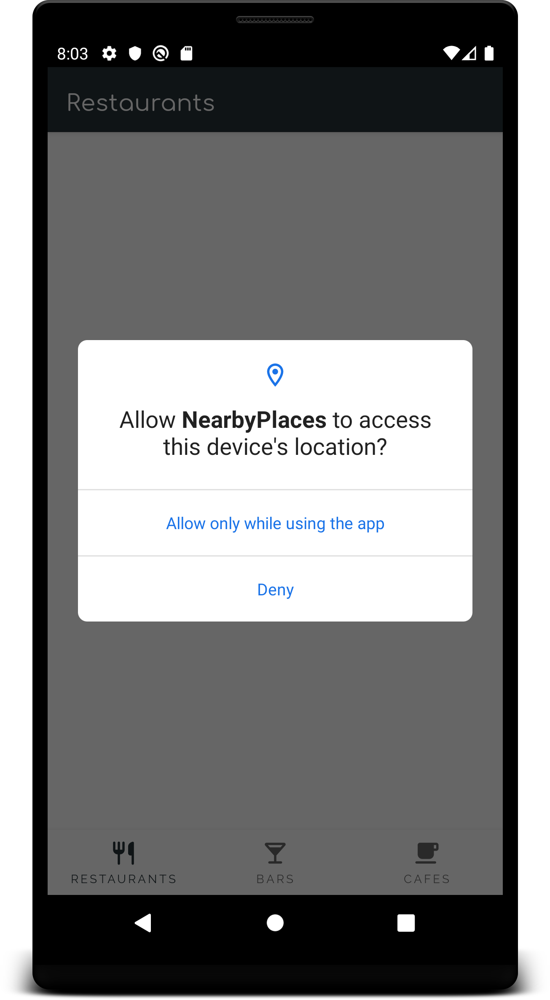
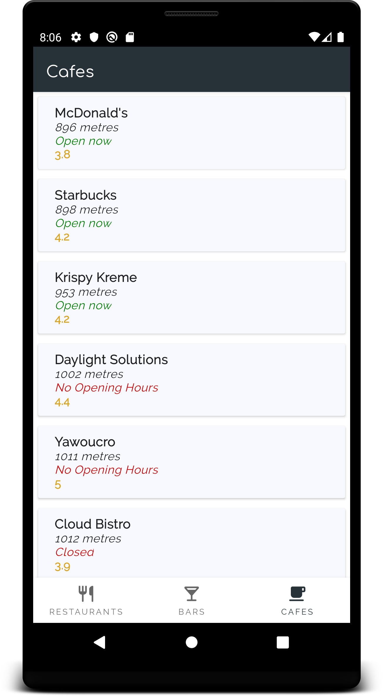
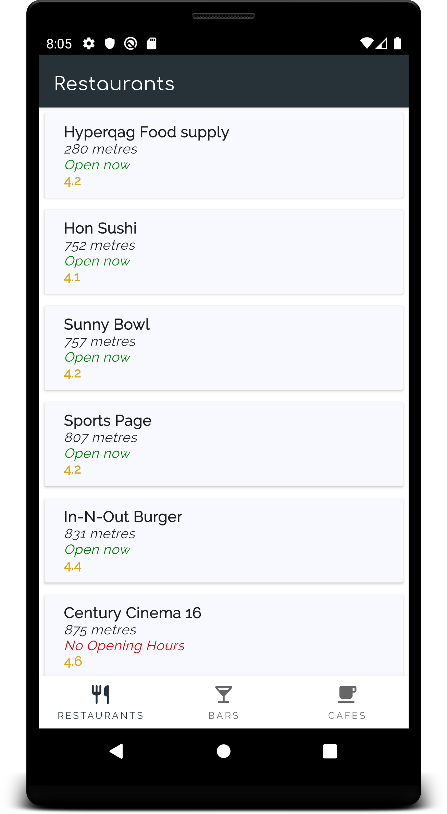

# NearbyPlaces

NearbyPlaces is an Android application with the main goal of showing my clean architecture approach, using several Architecture Components from [Android Jetpack](https://developer.android.com/jetpack), to do the following:
* Using the device location, help users to find restaurants, bars or cafes using Google Places API and
display a list of results, separated by category using a radius of 1500 metres by default.
* Each place detail display name, distance from the device location and the place, open now-closed and rating.
* The list of each category is sorted by distance from the closest to the farthest.
* Request device's location permission.

## Architecture & libraries
I used the following architecture, patterns and libraries:
* [Clean Architecture](https://proandroiddev.com/clean-architecture-data-flow-dependency-rule-615ffdd79e29)
* [MVVM](https://proandroiddev.com/mvvm-architecture-viewmodel-and-livedata-part-1-604f50cda1) pattern in presentation layer, using [ViewModel](https://developer.android.com/topic/libraries/architecture/viewmodel?gclid=CjwKCAjwwtTmBRBqEiwA-b6c_xzTC-8dos110OOgVQtVX2pFi1lNuJ7M4ZDlZo78pG2gFcQgAYyrIRoCOLAQAvD_BwE) and [LiveData](https://developer.android.com/topic/libraries/architecture/livedata)
* [RxJava](https://github.com/ReactiveX/RxJava) for concurrency in domain and data layers
* [Dagger](https://github.com/InsertKoinIO/koin) for dependency injection
* [Navigation](https://developer.android.com/guide/navigation) (Architecture component)
* [Retrofit](https://square.github.io/retrofit/) for networking, to retrieve data from Google Api 
* [Timber](https://github.com/JakeWharton/timber) for logging
* Unit testing using [JUnit](https://junit.org/junit5/)
* UI testing using [Mockito](https://site.mockito.org/)

## Screenshots

   

License
-------

    Copyright 2019 Gabriel Pozo Guzman

    Licensed under the Apache License, Version 2.0 (the "License");
    you may not use this file except in compliance with the License.
    You may obtain a copy of the License at

       http://www.apache.org/licenses/LICENSE-2.0

    Unless required by applicable law or agreed to in writing, software
    distributed under the License is distributed on an "AS IS" BASIS,
    WITHOUT WARRANTIES OR CONDITIONS OF ANY KIND, either express or implied.
    See the License for the specific language governing permissions and
    limitations under the License.
